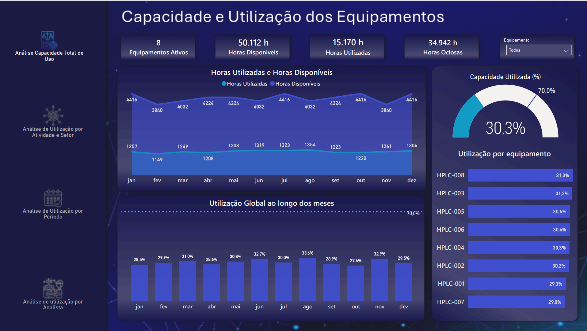
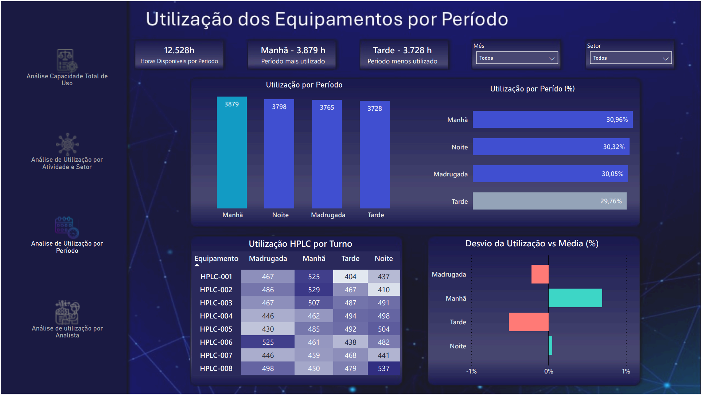
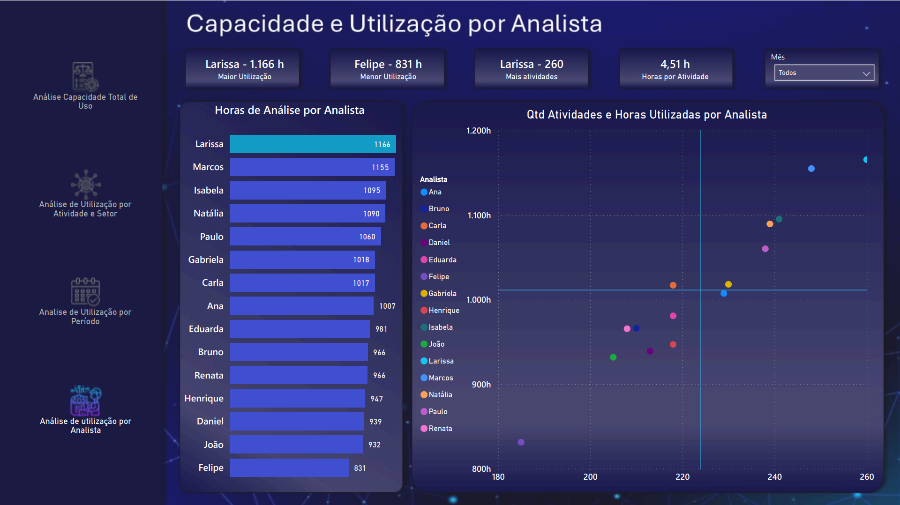
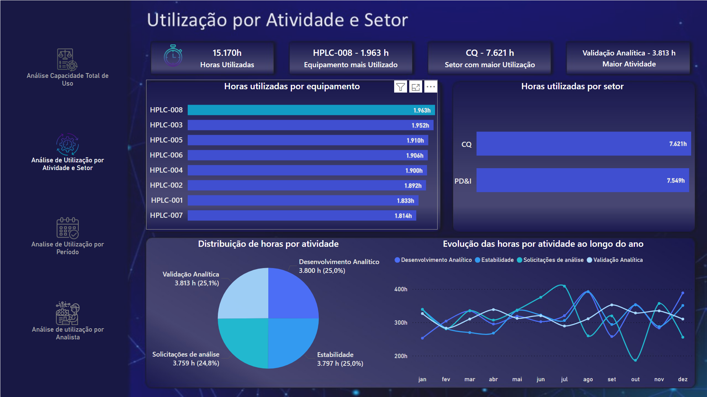

#    Análise de Utilização de Equipamentos

##  Objetivo

Desenvolver um dashboard em Power BI para análise da utilização de equipamentos, permitindo identificar eficiência operacional, ociosidade e padrões de uso ao longo do tempo, além de apoiar a tomada de decisão quanto à necessidade de aquisição de novos equipamentos ou adequação de turnos em períodos de menor utilização.

---

##     Principais Problemas
A falta de visibilidade sobre a utilização dos equipamentos pode gerar:
- Ociosidade elevada
- Má alocação de recursos
- Baixa eficiência operacional

Este dashboard foi desenvolvido para apoiar a tomada de decisão baseada em dados.

---

##    Indicadores
- Horas disponíveis
- Horas utilizadas
- Horas ociosas
- Porcentagem de utilização
- Ranking por equipamento
- Análise por analista

---

##    Análises 
- Utilização por equipamento
- Utilização por setor
- Utilização por atividade
- Utilização por período (manhã, tarde, noite, madrugada)
- Utilização por analista
- Desvio em relação à média

---

##   Insights
- Identificação de baixa utilização (ociosidade elevada)
- Diferença de performance entre equipamentos
- Variação de uso ao longo dos períodos
- Analistas com maior e menor produtividade

---

##   Ferramentas Utilizadas
- Power BI
- DAX
- Modelagem de dados

---

##  Dashboard
### 🔹 Visão Geral

---

### 🔹 Análise por Período

---

### 🔹 Análise por Analista

---

### 🔹 Análise por Setor

---

##  Arquivo
O arquivo `.pbix` está disponível neste repositório: 
https://app.powerbi.com/view?r=eyJrIjoiYzQ0NDhjOWMtYjM0My00OTdjLTkzODgtMzcxZjE4Mzg0MGVmIiwidCI6IjY1OWNlMmI4LTA3MTQtNDE5OC04YzM4LWRjOWI2MGFhYmI1NyJ9
